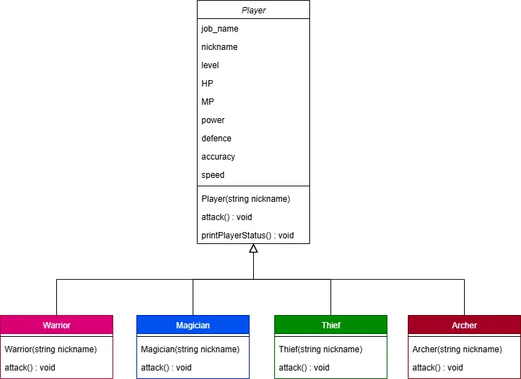

# 과제 내용 정리
- Player라는 기본 클래스를 정의 합니다.
    - Player 클래스에는 `attack()`이라는 순수 가상 함수를 포함합니다.
        - `attack()` 함수는 무기를 휘두르기만 하는 기본적인 공격 함수입니다.
- Player 클래스를 상속받아 다양한 직업 클래스를 생성합니다.
    - 예) Warrior, Magician, Thief, Archer
        - 각 직업 클래스에서 `attack()`함수를 **재정의**(오버라이딩)하여 해당 직업의 공격을 출력하면 됩니다!
- 메인 함수에서 Player 타입의 포인터 배열을 선언하고, 해당하는 번호를 입력하면 (1. 전사 2. 마법사 3. 도적 4. 궁수)  Warrior, Magician, Thief, Archer를 각각 배열의 원소로 선언합니다. → 이후 Player는 `attack()` 함수를 호출하여 공격합니다.
- 전체적인 구조는 아래와 같습니다.

---
## 2025-08-22
- 전직 시스템 구현
---
## 2025-08-20
- 프로젝트 셋업